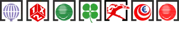

> #### Version 1.0.0
> - The result is available in JSON (Rich data content), XML (Poor content) and CSV (Poor content).
> - Three requests available: available bet types, latest bet and bets on a range of dates.
> - Realtime data.
 
 
<h1 align="center">Spanish Bet Scraping</h1>
 
 
 

    

 

    
     
    

    <a href="./CONTRIBUTING.md">Contributing</a>
    ·
    <a href="https://github.com/ZhengLinLei/betScrape-ES/issues">Issues</a>

    &nbsp;
    

 
 

    <h3 align="center">Avaliable API</h3>
    

        

            
            
            
        

        

            
            
        

        

            
            
            
            
        

    

